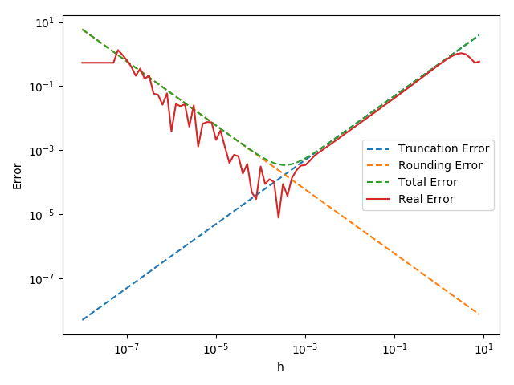
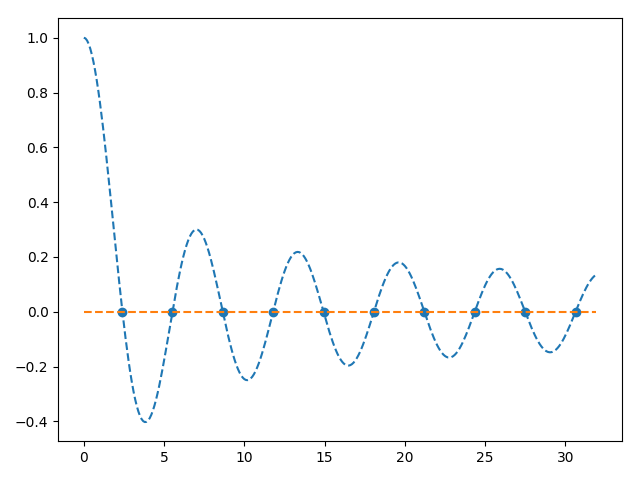
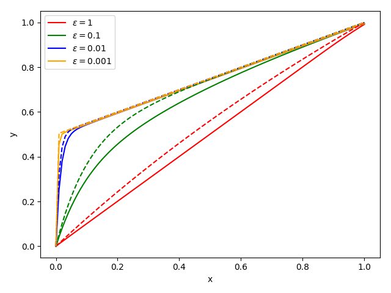
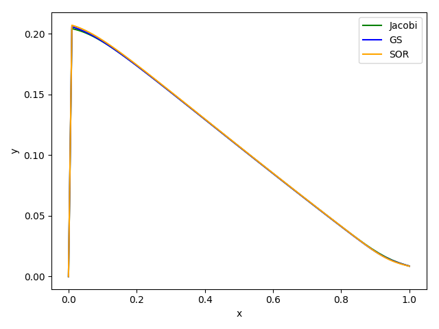
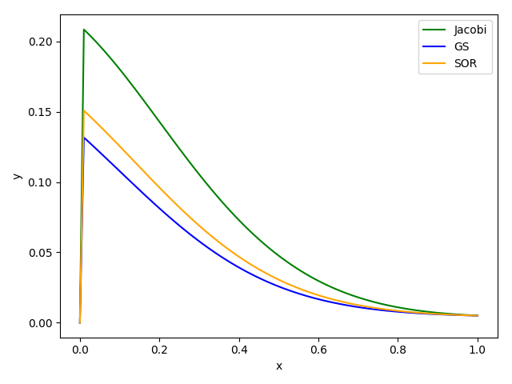
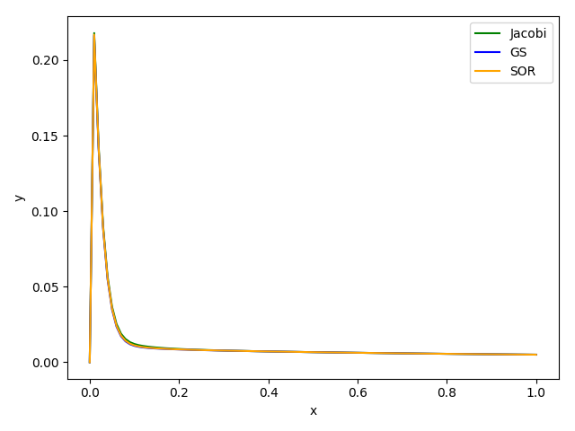
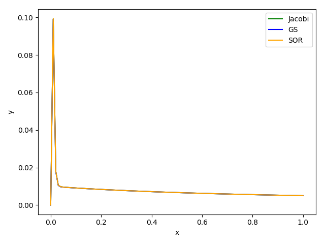

# 数值分析实验报告

> 计64 翁家翌 2016011446

我使用 python3 + numpy + scipy + matplotlib // g++ 完成如下的若干实验。

在 Mac/Linux 下使用命令 `./main` 即可产生如下所有结果，分别会打印在屏幕上，和输出到 `result/` 文件夹下。

## 1-1

代码位于 `t11.py` 中

### 运行结果

<div>


</div>
左边是使用单精度 `np.float32` 得出的结果，右边是使用双精度 `np.float64` 得出的结果。采用对数坐标轴画图。

### 实现过程

对于 float32，设定 $\epsilon$ 为 $2^{-24}$；对于float64，设定 $\epsilon$ 为 $2^{-53}$。这样做会比题目中更精确。步长 $h$ 在对数空间上面线性取点。

画图的时候，只需要画出 $\frac{Mh}{2}$、$\frac{2\epsilon}{h}$、$\frac{Mh}{2}+\frac{2\epsilon}{h}$ 和 $|\frac{\sin(x_0+h) - \sin(x_0)}{h} - \sin'(x_0)|$，其中 $x_0=1$，分别对应图中的 `Truncation Error`、`Rounding Error`、`Total Error` 和 `Real Error`。

### 结果分析

从运行结果中可以看出，截断误差随h的增加而增加，舍入误差随h的增加而减少。实际误差和总误差比较接近，32位、64位浮点数情况下分别有最小值约为 $10^{-3.5}$ 和 $10^{-7.5}$。

## 1-3

代码位于 `t13.cpp` 中

### 运行结果

```
----------t13 result----------
n = 2097152
float32: 15.4036827087	float64: 15.1333066951
inv 1e9: use 5.429354s
-----------end t13------------
```

### 实现过程

只需要最初确定类型（float or double），然后依次for循环累加即可。当上一次的值和这一次相同时退出循环。

### 结果分析

实验现象：

1. 可以看出在 `n=2097152` 时，使用单精度累加 $\sum_i 1/i$ 的数值不再改变。最终的值为 `15.4036827087`。
2. 当 `n=2097152` 时，总和为 `15.1333066951`，和单精度误差为 `0.2703760136`。
3. 跑不出来，放弃了

理论分析：

1. 对于单精度浮点数有 $\epsilon_{\mathrm{match}}=\frac{1}{2}\times 2^{1-24}=2^{-24}$，当n较大时，$\sum_{n=1}^\infty \frac{1}{n}\rightarrow \ln(n+1)$。发生“大数吃小数”的情况时，有$|\frac{1}{n}/\ln(n+1)|\le \frac{1}{2}\epsilon_{\mathrm{match}}$，即$n\ln(n+1)\ge 2^{25}$，解得$n\ge 2.29\times 10^6$，与实际结果相近。
2. 相对误差为 1.79%
3. 对于双精度浮点数，有$\epsilon_{\mathrm{match}}=2^{-53}$，不等式为$n\ln(n+1)\ge 2^{54}$，解得$n\ge 5.3\times 10^{14}$。使用 $n=10^9$ 测试运行时间为5.429354s，预计时间为 $5.43\times 5.3\times 10^5 = 2.9\times 10^6$ 秒，约为一个月（34天）

## 2-2

代码位于 `t22.py` 中

### 运行结果

```
----------t22 result----------
x0 = 0.6000000000
x1 = 1.1406250000, lambda = 0.0156250000
x2 = 1.3668136616, lambda = 1.0000000000
x3 = 1.3262798040, lambda = 1.0000000000
x4 = 1.3247202256, lambda = 1.0000000000
x5 = 1.3247179572, lambda = 1.0000000000
final result: x = 1.3247179572, f(x) = 0.0000000000
scipy gives: 1.3247179572
x0 = 1.3500000000
x1 = 2.4969585561, lambda = 0.0625000000
x2 = 2.2719762055, lambda = 1.0000000000
x3 = 2.2369017058, lambda = 1.0000000000
x4 = 2.2360684434, lambda = 1.0000000000
x5 = 2.2360679775, lambda = 1.0000000000
final result: x = 2.2360679775, f(x) = -0.0000000000
scipy gives: 2.2360679775
-----------end t22------------
```

### 实现过程

基本按照书上的伪代码实现。$\lambda_0=1$，​$\epsilon=10^{-4}$。

### 结果分析

阻尼牛顿法一定程度上避免了牛顿法由于初始$x_0$离准确解$x^*$太远而导致的发散问题，但是通过观察上述数据发现，$\lambda$只在第一次迭代中起到了效果，之后由于与$x^*$已经比较接近而退化为普通的牛顿迭代法。

## 2-3

代码位于 `t23.py` 中

### 运行结果

```
----------t23 result----------
#1: x = 2.4048255577 J0(x) = 0.0000000000
#2: x = 5.5200781103 J0(x) = -0.0000000000
#3: x = 8.6537279129 J0(x) = -0.0000000000
#4: x = 11.7915344390 J0(x) = 0.0000000000
#5: x = 14.9309177085 J0(x) = 0.0000000000
#6: x = 18.0710639679 J0(x) = 0.0000000000
#7: x = 21.2116366299 J0(x) = 0.0000000000
#8: x = 24.3524715307 J0(x) = 0.0000000000
#9: x = 27.4934791318 J0(x) = 0.0000000000
#10: x = 30.6346064684 J0(x) = -0.0000000000
-----------end t23------------
```



### 实现过程

首先先估计一下第十个零点的位置，画图画出来发现在32以内。然后从0到32，每隔0.1在贝塞尔曲线上取一个点，一旦发现相邻两个点跨过 y=0 这条线，那么就送到 `fzerotx` 函数中，求出确切的零点。

`fzerotx` 函数参考书上的伪代码，将其转换成了 python 版本。

### 结果分析

从图中可以看出零点找得很准。

## 3-6

代码位于 `t36.py` 中

### 运行结果

```
----------t36 result----------
n = 10 , delta = 0
||r||_inf: 4.440892098500626e-16
||dx||_inf: 6.943372649304003e-05
n = 10 , delta = 1e-07
||r||_inf: 2.220446049250313e-16
||dx||_inf: 0.00023584844566038043
n = 8 , delta = 0
||r||_inf: 4.440892098500626e-16
||dx||_inf: 6.025062604386733e-08
n = 12 , delta = 0
||r||_inf: 2.220446049250313e-16
||dx||_inf: 0.5521155258554964
-----------end t36------------
```

### 实现过程

首先Hilbert矩阵可以使用 `scipy.linalg` 中的 `hilbert` 函数来生成；Cholesky 方法按照书上的伪代码实现，由于numpy的机制可以节省大量代码；解方程 $Hx=b$ 的时候，先使用 Cholesky 分解 $H=LL^T$ 得到矩阵 $L$，方程变为 $LL^Tx=b$，可以先解方程 $Ly=b$ 解出 $y$，之后解方程 $L^Tx=y$ 解出 $x$ 即可。

在写完 Cholesky 函数之后，我使用 numpy 内置的 `np.linalg.cholesky` 函数确保了正确性无误。

### 结果分析

从实验结果中可以看出，$||r||_\infty$在所有情况下都很小，在$\epsilon_{\mathrm{match}}$的数量级上；而$||\Delta x||_\infty$随着$n$的增长而超线性增长，说明Hilbert矩阵随着$n$的增大，病态性越严重。同时，$||\Delta x||_\infty$受扰动影响也很大。

## 4-2

代码位于 `t42.py` 中

### 运行结果

```
----------t42 result----------
eps = 1 , a = 0.5 , n = 100
cnt: JC 43	GS 22	SOR 23
eps = 0.1 , a = 0.5 , n = 100
cnt: JC 1423	GS 968	SOR 1091
eps = 0.01 , a = 0.5 , n = 100
cnt: JC 367	GS 235	SOR 275
eps = 0.001 , a = 0.5 , n = 100
cnt: JC 136	GS 116	SOR 133
-----------end t42------------
```



<div>




</div>
最上面是 $\epsilon$ 为各种取值的时候，真实解（虚线）和数值解（实线）的差距；下面四幅图，从左到右依次为 $\epsilon$ 为 1、0.1、0.01、0.001 的时候，各种算法解出来的y的值以及真实解的情况。

### 实现过程

构造方程 $Ay=b$：其中矩阵 $A$ 按照书中的形式构造，$b$ 书中说为 $ah^2$，但是我试了下这么设置之后解出来的 $y$ 不符合真实解（比如解完之后 $y_0=1$），仔细分析之后发现如果要满足书中的方程 $(\epsilon+h)y_{i+1} - (2\epsilon+h)y_i+\epsilon y_{i-1} = ah^2$ 的话，$b$ 的最后一项应该是 $ah^2-\epsilon-h$ 而不是 $ah^2$。

Jacobi、GS、SOR的实现方式大同小异，都是按照书上讲的原理来写，此处以SOR为例，python代码如下：

```python
def SOR(A, b, x, eps=1e-4, w=0.9):
	x = x.copy()
	cnt = 0
	while True:
		cnt += 1
		x_old = x.copy()
		for i in range(b.shape[0]):
			x[i] += w * (b[i] - A[i].dot(x)) / A[i, i]
		if abs(x_old - x).max() < eps:
			return x, cnt
```

可以看到利用numpy的机制，代码可以少不少，比书上简洁非常多。并且按照这种方式来写，GS和SOR代码上只相差一个 `w*`。

SOR默认取 $w=0.9$。

### 结果分析

$\epsilon=1$ 时，三种方法的误差都比较大。而当 $\epsilon$ 取更小的值的时候，可以得到更精确的结果。特别地，当 $\epsilon = 0.001​$ 时可以得到十分精确的结果。

对于稀疏矩阵而言，使用这三种方法可以极大地降低运算复杂度。相对于高斯消元法而言，可以极大地提高
大规模计算的效率。

从结果中可以看出 Gauss-Seidel 方法的鲁棒性更强,，在各种 $\epsilon$ 的取值下的迭代次数都是最少的，收敛速度最快。

这三种方法并不是万能的，当 $\epsilon$ 取值较大时，这些算法并不能很好地收敛。

## 5-1

代码位于 `t51.py` 中

### 运行结果

```
----------t51 result----------
x_A: [ 0.6740212 -1.         0.8895574] 
lambda_A: 12.254312320922107 , cnt_A: 14
x_B: [ 0.60397234 -1.          0.25113513 -0.14895345] 
lambda_B: 98.52169771418666 , cnt_B: 6
-----------end t51------------
```

对矩阵A而言，$\lambda_{A_1} = 12.254312320922107$，对应特征向量 $x_{A_1}=(0.6740212,-1,0.8895574)$。求解迭代了14次；

对于矩阵B而言，$\lambda_{B_1}=98.52169771418666$，对应特征向量 $x_{B_1}=(0.60397234, -1, 0.25113513, -0.14895345)$。求解迭代了6次。

### 实现过程

就是一个for循环，直接按照书上P155的代码写就行。

初始化采取随机初始化；迭代终止条件为 $|\lambda^{k+1}-\lambda_k|<\epsilon=10^{-5}$。

### 结果分析

由于采用了向量规格化的方法，因此算法没有溢出的现象，精确度较高。与第三方软件的解法相差无几。

矩阵A需要的迭代次数更更多，可能原因是它的收敛比值 $r=\frac{\lambda_1}{\lambda_2}​$ 较小，收敛较慢。

此外发现算法的收敛速度还和初始值的选取有关，具体而言，当初始值选择得与特征向量较为接近时，收敛速度很快；而当初始值选择与特征向量差别较大时，收敛速度较慢。

## 5-3

代码位于 `t53.py` 中

### 运行结果

```
----------t53 result----------
Cannot solve A!
None
-----------end t53------------
```

### 实现过程

Householder算法按照书上P169来写。注意不能直接使用 $\sigma_k=a_{kk}$ 这条判断语句，因为如果对角元素为0，$sign(a_{kk})=0$，$\sigma_k$ 必为0，会直接跳过，然而此时有可能第k列对角线下方元素有的不为0，因此书上写错了。

QR分解基于Householder算法，此处不再详细说明。

QR算法按照书本P172来写。由于该题中可能会产生死循环，因此我限定了最大迭代次数1000，超过该值则说明无法求解。

### 结果分析

迭代无法收敛。因为`A`本身是正交矩阵，QR分解之后的`R`为`I`或`-I`，对应的`Q`为`A`或`-A`，A'=RQ=A保持不变，因此无法收敛。

## 5-4

代码位于 `t54.py` 中

### 运行结果

```
----------t54 result----------
cnt = 3
[-1.00000071  1.00000052  1.00000017  1.00000002]
-----------end t54------------
```

### 实现过程

QR分解同5-3，此处不再复述。

主循环的写法参考书本P176伪代码。

### 结果分析

在三次迭代之后基本收敛，求得A的特征值分别为-1,1,1,1，说明原点位移技术能够让QR算法对更一般的矩阵收敛。