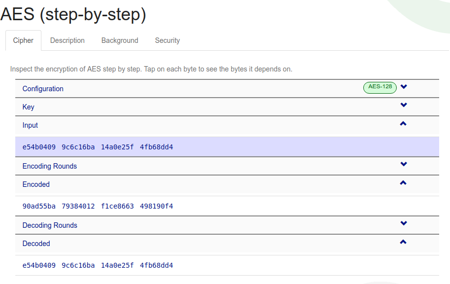
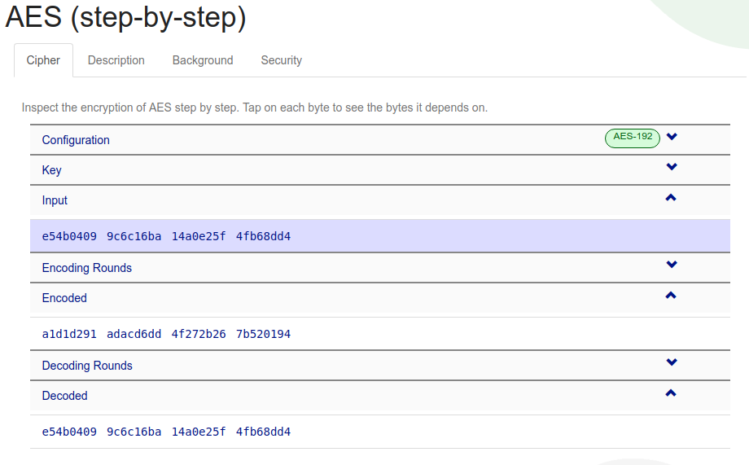
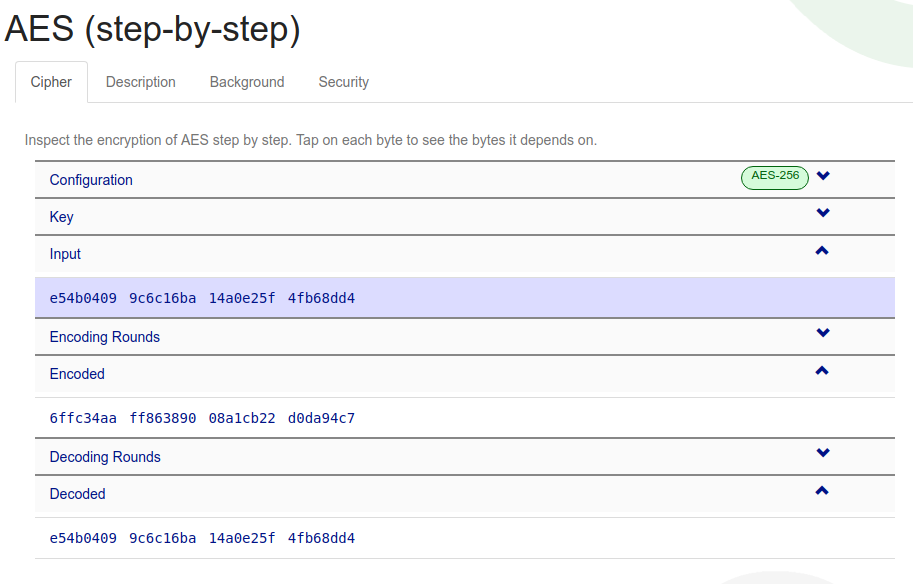
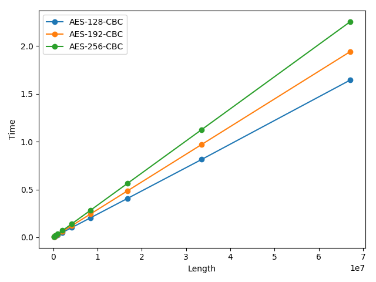
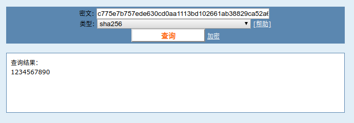
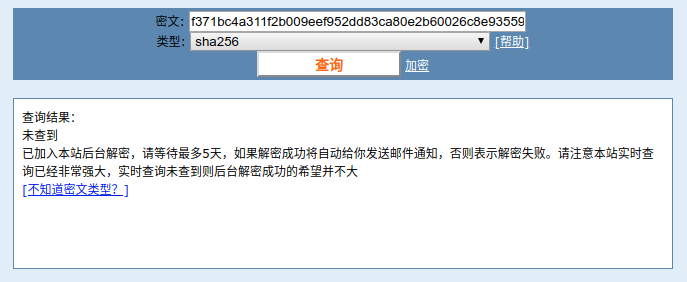
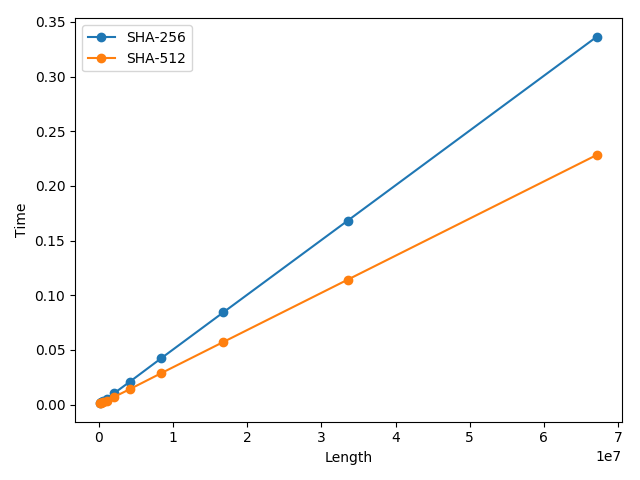

# 密码学第二次作业

> 计64 翁家翌 2016011446

## AES

实现了AES-128-CBC、AES-192-CBC、AES-256-CBC，位于`aes.cpp`中。

编译方法：`g++ aes.cpp -oaes -O3`

运行：`./aes argv1 argv2`

其中：argv1表示使用AES类别，可选项为`128`、`192`、`256`

argv2如果为0，表示测试给定的明文，验证正确；不为0则当做性能测试，生成长度为argv2的随机字符串进行测试。

### Example

`./aes 128 0` 表示使用AES-128，题目中给定的明文，测试加密解密

`./aes 256 1000000` 表示使用AES-256-CBC，加密随机生成的长度为1000000的字符串，输出加密时间

### Result

正确性验证：

```bash
➜  hash git:(master) ✗ ./aes 128 0
origin  : e54b0409 9c6c16ba 14a0e25f 4fb68dd4 
crypto  : 90ad55ba 79384012 f1ce8663 498190f4 
decrypto: e54b0409 9c6c16ba 14a0e25f 4fb68dd4 
➜  hash git:(master) ✗ ./aes 192 0
origin  : e54b0409 9c6c16ba 14a0e25f 4fb68dd4 
crypto  : a1d1d291 adacd6dd 4f272b26 7b520194 
decrypto: e54b0409 9c6c16ba 14a0e25f 4fb68dd4 
➜  hash git:(master) ✗ ./aes 256 0
origin  : e54b0409 9c6c16ba 14a0e25f 4fb68dd4 
crypto  : 6ffc34aa ff863890 08a1cb22 d0da94c7 
decrypto: e54b0409 9c6c16ba 14a0e25f 4fb68dd4 
➜  hash git:(master) ✗ 
```

可见加密解密实现正确，并且与在线演示网站 https://www.cryptool.org/en/cto-highlights/aes 上的结果吻合



性能测试：使用命令 `python3 test_aes.py 100` 即可运行测试

16K为16384个char，10M为10485760个char，取100次平均的运行时间，如下：

| Method      | 16384     | 10485760  |
| ----------- | --------- | --------- |
| AES-128-CBC | 0.000877s | 0.255326s |
| AES-192-CBC | 0.000778s | 0.306994s |
| AES-256-CBC | 0.001028s | 0.358829s |

因此，AES-128-CBC可达到39.17M/s速度，AES-192-CBC可达到32.57M/s速度，AES-256-CBC可达到27.87M/s速度。更精细的结果见下图：



## SHA2

由于之前布置的是B5B6而不是B16B18，理解成了SHA2，就不管了2333

代码实现位于 `sha2-256.cpp` 和 `sha2-512.cpp` 中。以前者为例：

编译：`g++ sha2-256.cpp -osha256 -O3`

运行：`./sha256 argv1`

其中 argv1 如果是0表示测试给出的11个例子，不为0表示性能测试，随机生成长度为argv1的字符串，输出运行时间

### Example

`./sha256 0` 表示使用SHA2-256，测试11个给出的例子

`./sha512 1000000` 表示使用SHA2-512，加密随机生成的长度为1000000的字符串，输出加密时间

### Result

正确性验证：我在test里面assert了11次，如果有一个没通过则直接crash

```bash
➜  hash git:(master) ✗ ./sha256 0  
c775e7b757ede630cd0aa1113bd102661ab38829ca52a6422ab782862f268646
sha256: sha2-256.cpp:84: void test(): Assertion `strcmp(hash("1234567890"), "f371bc4a311f2b009eef952dd83ca80e2b60026c8e935592d0f9c308453c813e") == 0' failed.
[1]    21407 abort (core dumped)  ./sha256 0
➜  hash git:(master) ✗ ./sha512 0
12b03226a6d8be9c6e8cd5e55dc6c7920caaa39df14aab92d5e3ea9340d1c8a4d3d0b8e4314f1f6ef131ba4bf1ceb9186ab87c801af0d5c95b1befb8cedae2b9
sha512: sha2-512.cpp:86: void test(): Assertion `strcmp(hash("1234567890"), "72ec1ef1124a45b047e8b7c75a932195135bb61de24ec0d1914042246e0aec3a2354e093d76f3048b456764346900cb130d2a4fd5dd16abb5e30bcb850dee843") == 0' failed.
[1]    21547 abort (core dumped)  ./sha512 0
```

我把1234567890放到最后一个assert，可见11个中有10个都过了。剩下这个在两个SHA2算法中都没过，我起初怀疑是自己写的有问题，后面在网络上测试了至少5个其他实现，发现都和我输出的一样，于是开始怀疑是不是书里面写错了……而且把书里面的hash值放到cmd5上找，也没找到一个明文，按理说这种常见的hash都能在上面找到明文。





c77是我的结果，f37是书中给出的结果。

性能测试：使用长度1M=1048576的随机生成字符串进行测试，取1000次平均

| Method   | Time     |
| -------- | -------- |
| SHA2-256 | 0.005289 |
| SHA2-512 | 0.003627 |

更精细的结果如下：



我拿长度为 $2^{26}=67108864$ 的字符串来测算，可以算出SHA2-256速度为190.26M/s，SHA2-512速度为280.36M/s

这里有一个很神奇的现象，就是SHA2-512跑得比SHA2-256来得快，可能由于我机子是64位的原因，除此之外没想到其他解释。

