# 清华校园网身份认证以及单点登录安全分析

> 计42 靳子豪
>
> 计64 翁家翌

[TOC]

## WEB

以info/learn为根节点，统计结果如下：

http明文POST密码：×59

http明文GET密码：×2

使用https加密：×(19+1)

使用https加密的网站数量占全部网站的24.7%；75.3%的网站采用了不安全的通信方式。

### 使用HTTP并且账号与info互通

共27个网站

#### [学生邮箱](http://mails.tsinghua.edu.cn/) 

登陆之后不会自动跳转到https

手机版使用http登录：http明文POST密码

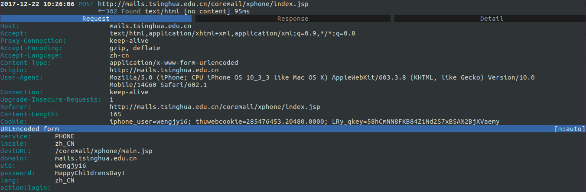

电脑版：https明文POST密码，不能直接mitm

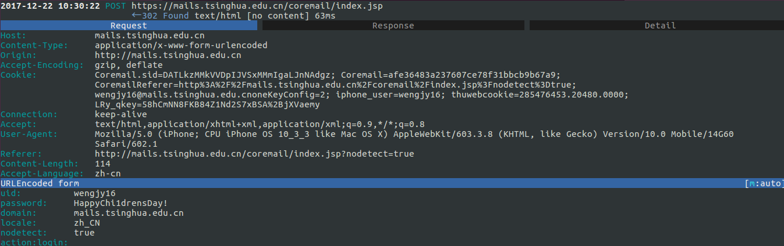

深研院也是一样。

#### [网络学堂**课程登录**](http://learn.tsinghua.edu.cn/learn/courseinfo.jsp?course_id=25512)

http明文POST密码

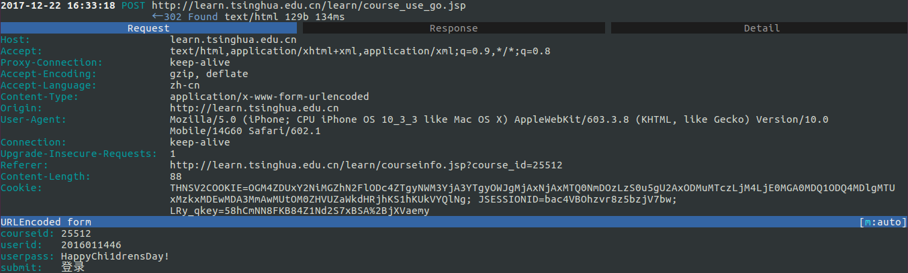

#### [实验室安全教育](http://aqjy.tsinghua.edu.cn/login.jsp)

http明文POST密码，重定向之后密码哈希

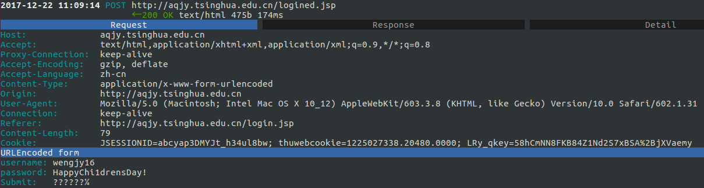

#### [体育代表队平台](http://sports.student.tsinghua.edu.cn/login/)

http明文POST密码

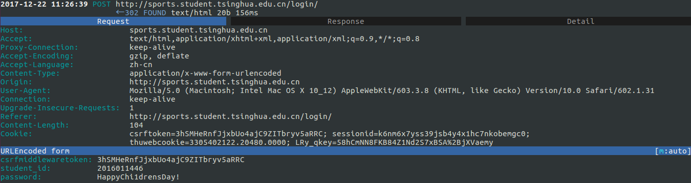

#### [仪器共享服务平台](http://yqgx.tsinghua.edu.cn/login.jsp) 

http明文POST密码，js每次都加载

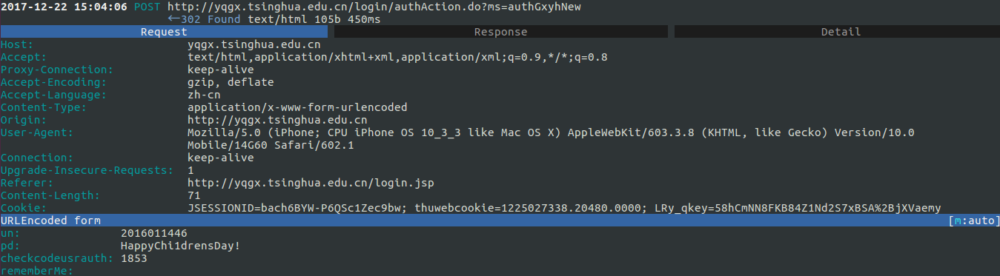

<!-- http://yqgx.tsinghua.edu.cn/profile/profileAction.do?ms=reg1 -->

#### [校园一卡通自助查询系统](http://ecard.tsinghua.edu.cn/user/Index.do)

http明文POST密码

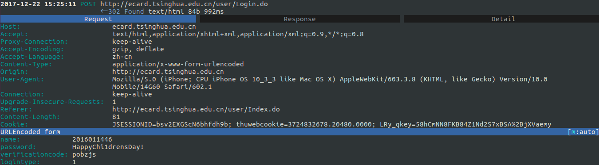

<!-- #### [综合信息服务管理员页面](http://jxxxfw.cic.tsinghua.edu.cn/admin/showzhxxfw.jsp) -->

#### [我们的家园](http://myhome.tsinghua.edu.cn/Netweb_List/Netweb_Home_Postbox_ListMore.html) 

http明文POST密码

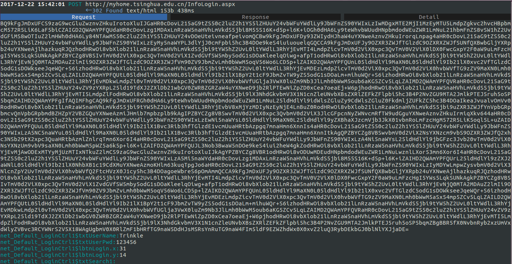

手机版：http://m.myhome.tsinghua.edu.cn/Loginwindow.aspx

http明文POST密码

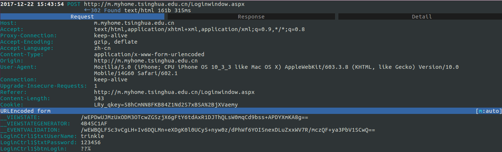

#### [实验室安全课考试系统](http://aqk.cic.tsinghua.edu.cn)

http明文POST密码

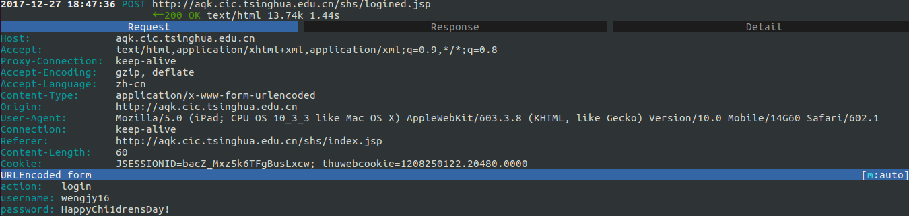

#### [信息化用户服务平台](http://its.tsinghua.edu.cn/)

http明文POST密码

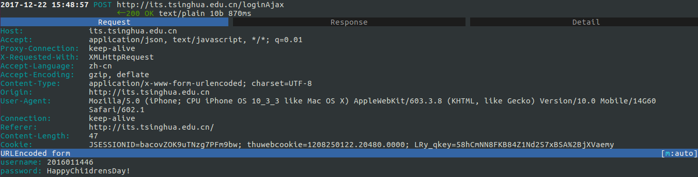

#### [学科信息网](http://xkxx.tsinghua.edu.cn/xkxxw/)

http明文POST密码

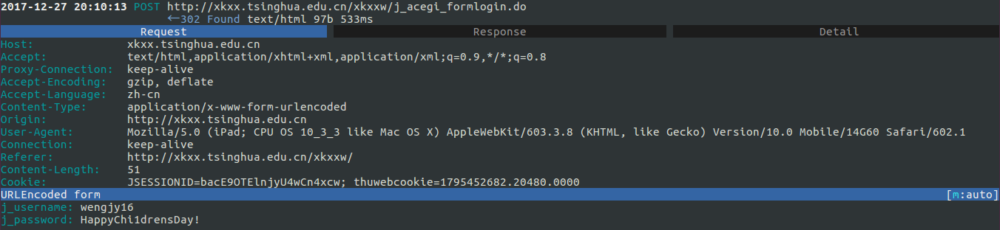

<!-- [党员管理](http://dygl.cic.tsinghua.edu.cn/sysadm/zzjg/mainindex.jsp) 不让进，错误信息没藏起来 http://dygl.cic.tsinghua.edu.cn/login.do -->

#### [三中心一体化信息化平台](http://counseling.tsinghua.edu.cn/xsglxt/loginXxfzzx)

http明文POST密码

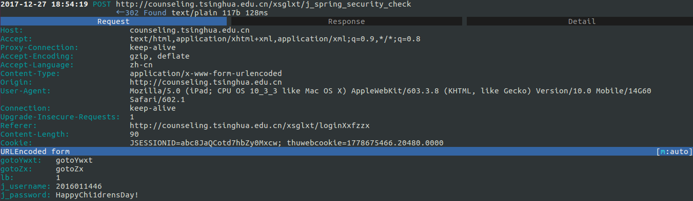

#### [会议活动及场所管理系统](http://em.internal.tsinghua.edu.cn/f/login) 

感觉像是一个软工作业？

http明文POST密码

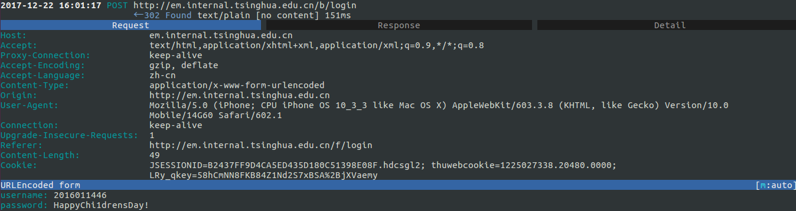

#### [研究生申请系统](http://gradadmission.tsinghua.edu.cn)

http明文POST密码

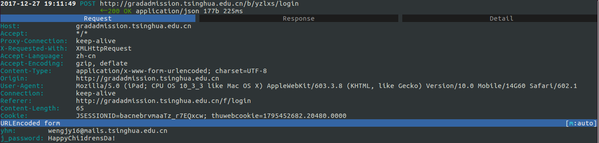

#### [教学研究与培训中心](http://qiyuan.tsinghua.edu.cn/home.jspx)

http明文POST密码

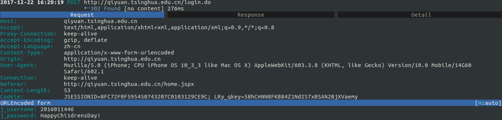

#### [内网信息发布平台](http://postinfo.tsinghua.edu.cn/user/login?destination=f) 

看起开很老了，最迟的信息是2007年的

http明文POST密码，部分使用info账户系统

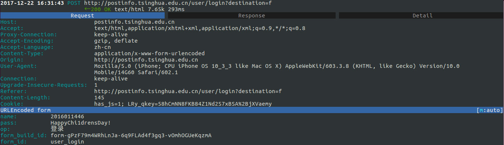

<!--#### [艺教中心演出官网后台](http://www.hall.tsinghua.edu.cn/login) http明文POST密码-->

<!-- #### [科研院](http://oars.tsinghua.edu.cn/) 同上 -->

#### [Overseas Management Office](http://mnc.rd.tsinghua.edu.cn/new/index.jsp)

http明文POST密码

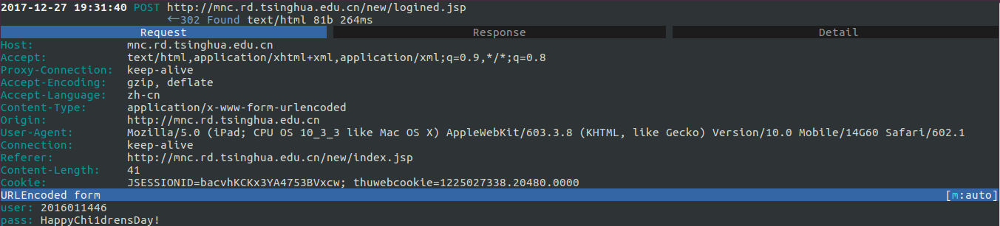

#### [新闻投稿系统](http://news-submit.tsinghua.edu.cn/)

看起来像是一个软工作业？

http明文POST密码

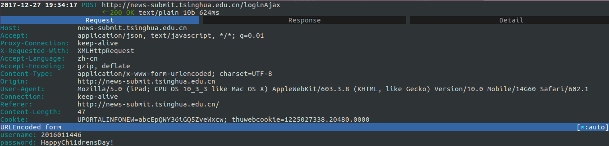

#### [统一权限管理](http://jxqxgl.cic.tsinghua.edu.cn/)

http明文POST密码，有权限确认

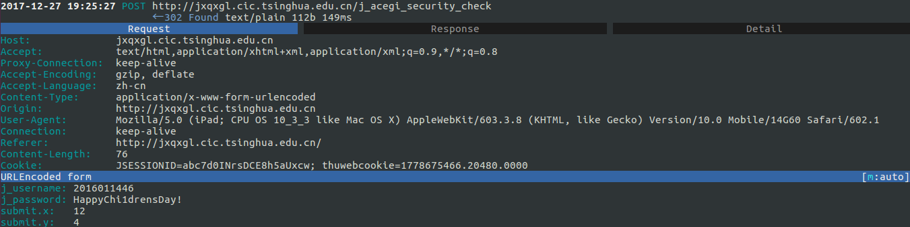

#### [博士后](http://postdoctor.tsinghua.edu.cn/)

http明文POST密码

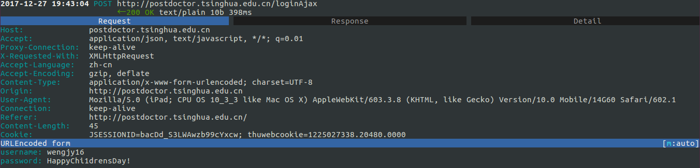

#### [两办内部办公网](http://xxbg.cic.tsinghua.edu.cn/lbxxw/lbxx/index.jsp)

http明文POST密码，有权限确认

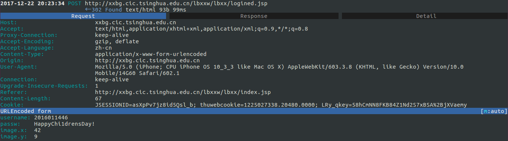

<!-- [国防网](http://guofang.tsinghua.edu.cn/) 没法登陆-->

#### [研究生院](http://yjsy.cic.tsinghua.edu.cn/docinfo/index.jsp)

http明文POST密码

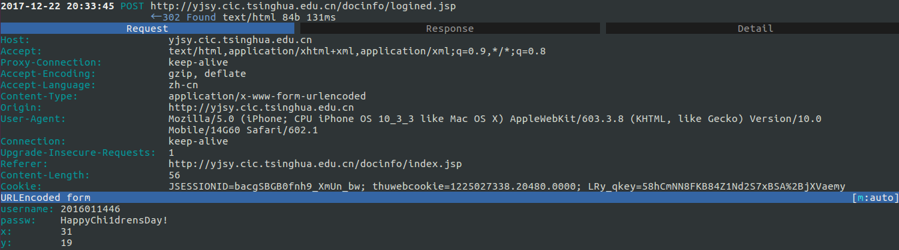

#### [资产处](http://fdcglc.cic.tsinghua.edu.cn/fgc/index.jsp)

http明文POST密码

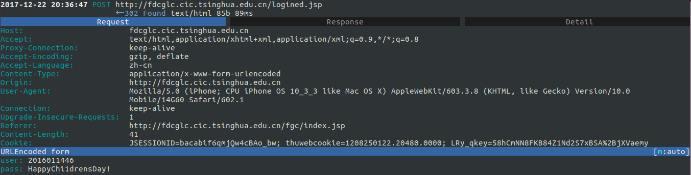

#### [学生部](http://xsc.cic.tsinghua.edu.cn/docinfo/)

http明文POST密码

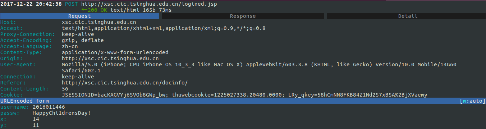

#### [国际合作与交流处](http://gjcbg.cic.tsinghua.edu.cn/gjc/)

http明文POST密码，有权限确认

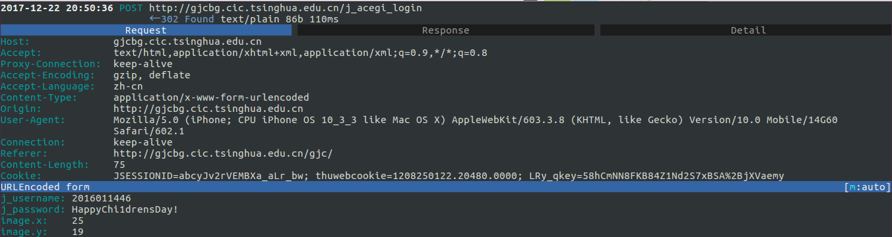

#### [工会](http://ghxt.cic.tsinghua.edu.cn/ghxt/index.jsp)

http明文POST密码

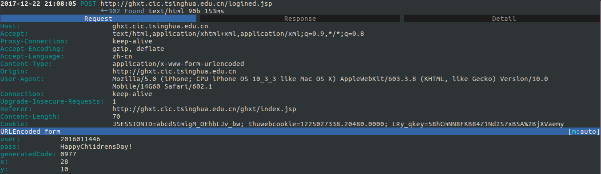

#### [推研专栏](http://sykxxfb.cic.tsinghua.edu.cn/)

http明文POST密码，不能确定和info是不是一套密码系统

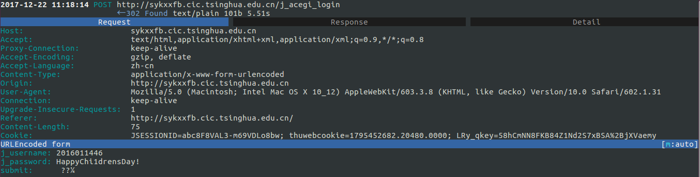

#### 部门信息发布

很多网站登录接口都是http://bmxxfb.cic.tsinghua.edu.cn/login.jsp?website=xxx

[财务处](http://bmxxfb.cic.tsinghua.edu.cn/cwc/index.jsp) 、[审计室](http://bmxxfb.cic.tsinghua.edu.cn/login.jsp?website=sjs)、[继续教育](http://bmxxfb.cic.tsinghua.edu.cn/jpc/index.jsp)等，不一一列举

http明文POST密码，不确定是否和info共用一套密码系统

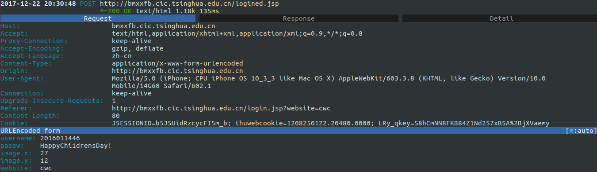

### 使用HTTP并且账号与info不互通

共32个网站

#### [国际学生（本科）申请系统](http://apply.join-tsinghua.edu.cn/international)

http明文GET密码

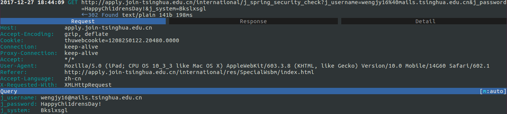

#### [集体户口卡借阅](http://jthkkcx.cic.tsinghua.edu.cn/login.do)  

http明文GET密码

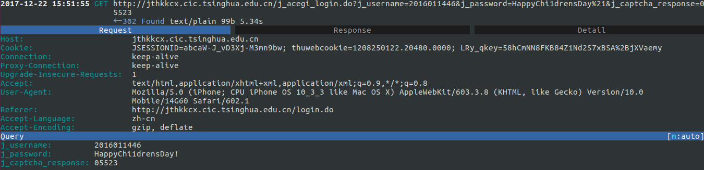

- 奇怪的问题：admin admin 卡好久

#### [教学评估](http://jxgl.cic.tsinghua.edu.cn/jxpg/)

http明文POST密码

#### [退学入口](http://bylx.cic.tsinghua.edu.cn/)

http明文POST密码

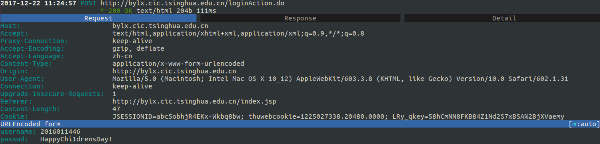

#### [人员招聘](http://zhaopin.rsc.tsinghua.edu.cn/zpgl/user/goToLogin.dox)

http明文POST密码

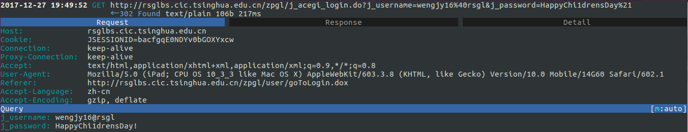

#### [研究生导师自测系统](http://director.internal.tsinghua.edu.cn)

http明文POST密码

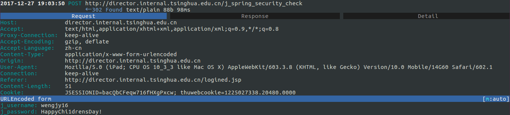

#### [计算机实验教学中心](http://friend.cic.tsinghua.edu.cn/openlab/index.jsp)

看起开很老了，最迟的信息是2008年的

http明文POST密码

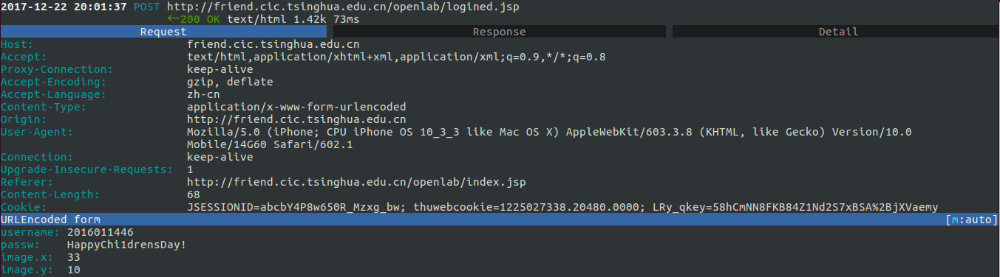

#### [研究生管理规定自测](http://director.internal.tsinghua.edu.cn/login.jsp)

http明文POST密码

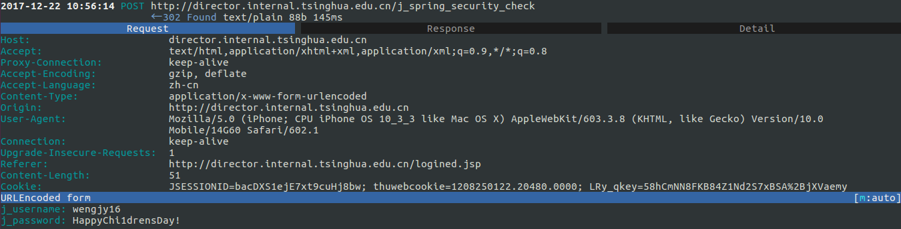

#### [活动场所管理系统](http://hdcsgl.syx.thcic.cn)

http明文POST密码

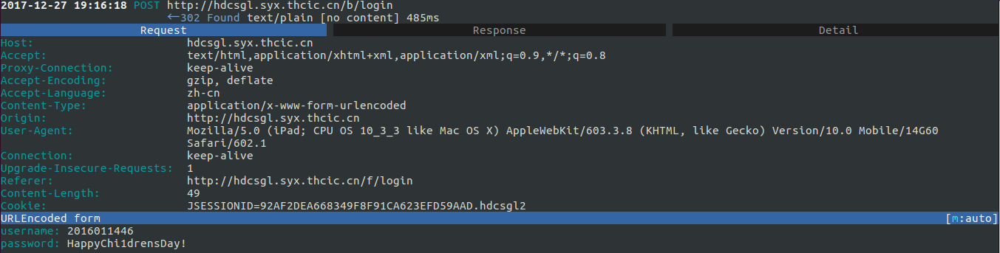

#### [普物实验室](http://166.111.214.111/)

http明文POST密码

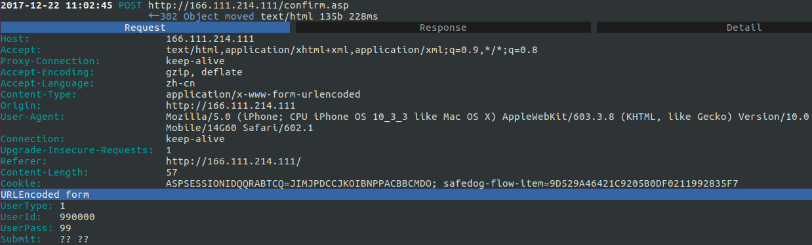

#### [外事信息管理系统](http://global.tsinghua.edu.cn/wsgl/login.do)与[信息发布](http://global.tsinghua.edu.cn/docinfo/index.jsp)

http明文POST密码，共用一套密码系统

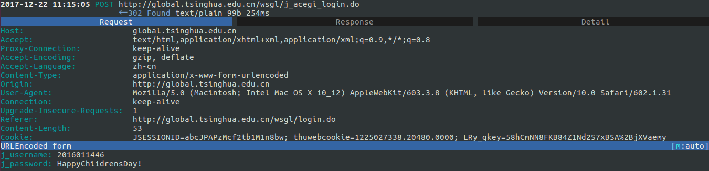

#### [计算机与信息管理中心](http://citrix.cic.tsinghua.edu.cn)

http明文POST密码

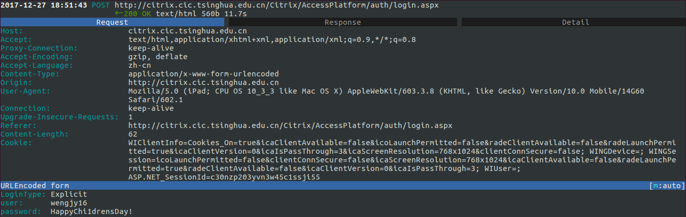

#### [艺术博物馆](http://member.artmuseum.tsinghua.edu.cn/)

http明文POST密码

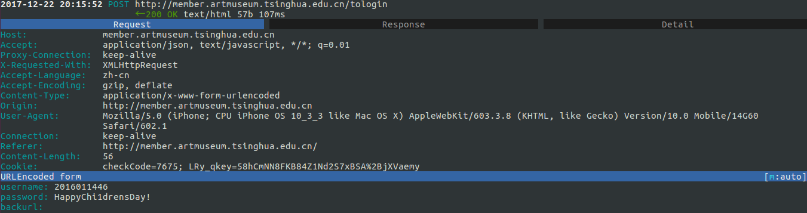

#### [信息化工作管理系统](http://xxb.tsinghua.edu.cn)

http明文POST密码

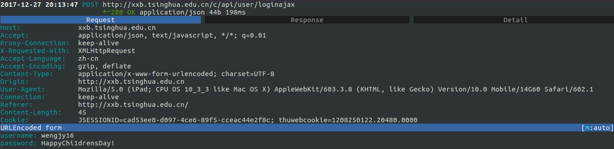

#### [统一银行代发系统](http://166.111.14.6/ifs/login.jsp)

http明文POST密码

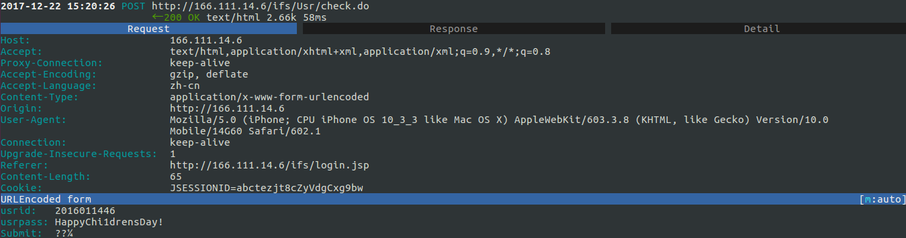

#### [银行代发查询](http://166.111.14.8:8080/info/)

http明文POST密码

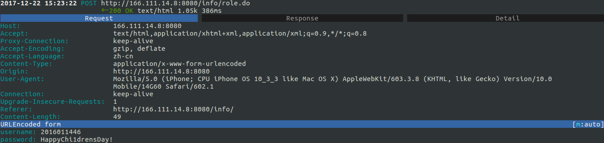

#### [科研办公信息网](http://kyybgxx.cic.tsinghua.edu.cn/kybg/)

http明文POST密码

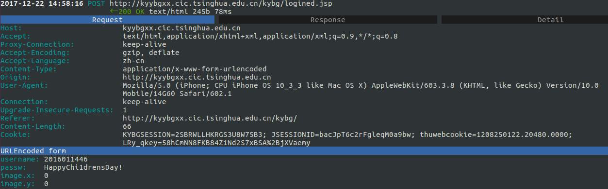

#### [保密知识教育考试](http://bmks.rd.tsinghua.edu.cn/login.jsp)

http明文POST密码

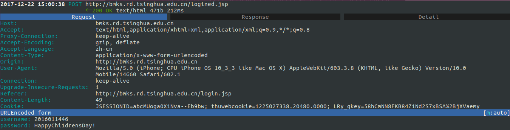

#### [仪器家具资产管理](http://zichan.tsinghua.edu.cn/)

http明文POST密码

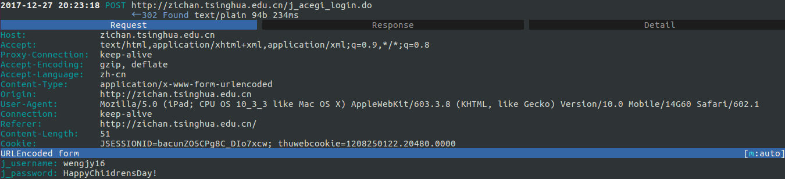

#### [科研信息系统](http://kyxxxt.cic.tsinghua.edu.cn/)

http明文POST密码

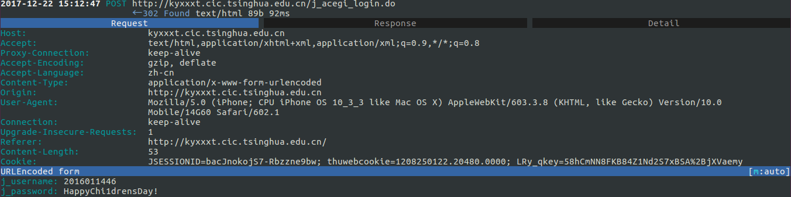

#### [网上自助报账系统](http://166.111.14.43/)

http明文POST密码，有ip限制

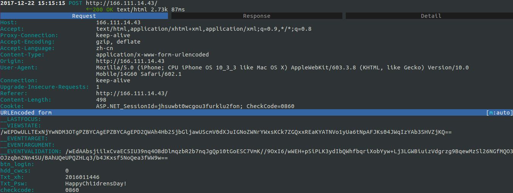

#### [教育基金会网上自助报账](http://166.111.14.94/wsyy/) 

http明文POST密码

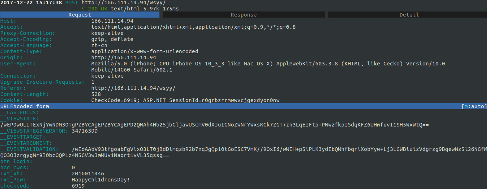

--> http://166.111.14.94/ ??????

#### [信息化技术中心内部办公网](http://oa.itc.tsinghua.edu.cn/)

http明文POST密码

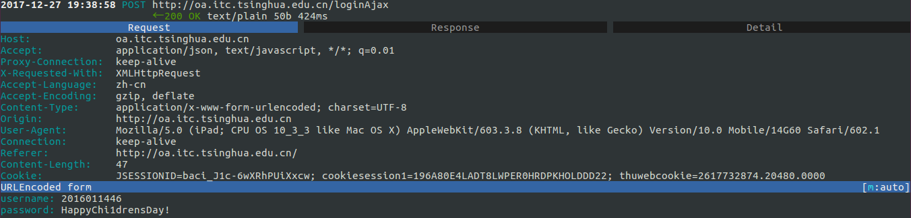

#### [党员学习平台](http://www.dangjian.tsinghua.edu.cn/)

http明文POST密码

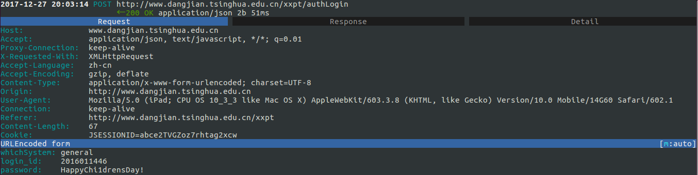

#### [继续教育学院办公信息系统](http://oa.sce.tsinghua.edu.cn/)

http明文POST密码

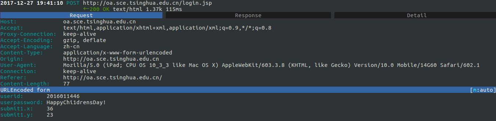

#### [课程资源中心](http://166.111.118.163/home.jspx)

http明文POST密码

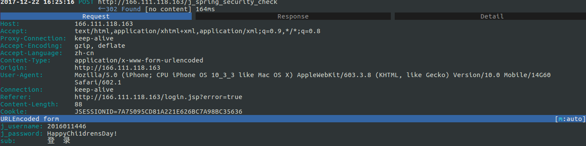

#### [人事处](http://rsc.tsinghua.edu.cn/rscbg/index.jsp)

http明文POST密码

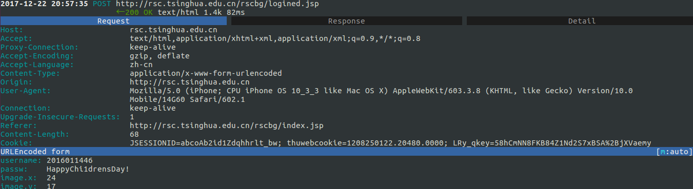

#### [后勤综合服务平台](http://wx.93001.cn/home/frontAction.do?ms=gotoIndex)

http明文POST密码

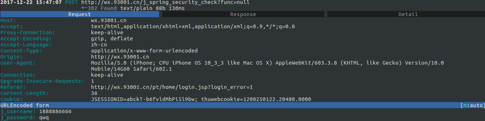

#### [设备购置管理系统](http://sbgz.cic.tsinghua.edu.cn/) 

http明文POST密码

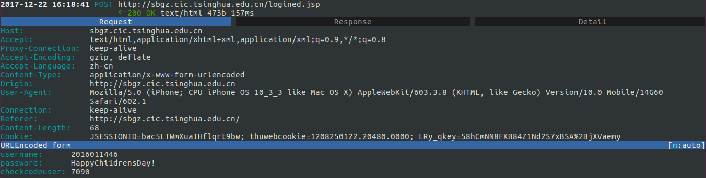

#### [办公自动化系统](http://oa.tsinghua.edu.cn)

http明文POST密码

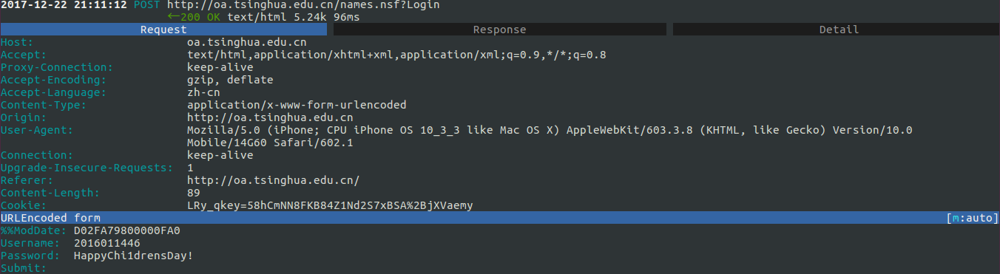

#### [档案馆](http://thdag.cic.tsinghua.edu.cn/docinfo/index.jsp)

http明文POST密码

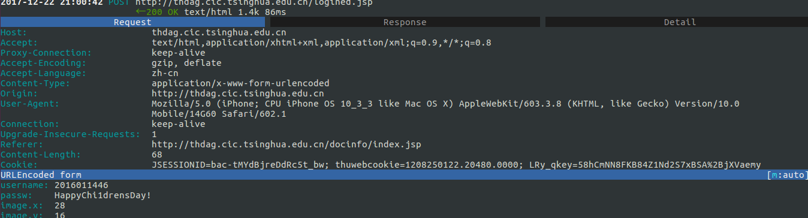

#### [清华园街道办事处](http://jdbsc.cic.tsinghua.edu.cn/jdbsc/index.jsp)

http明文POST密码

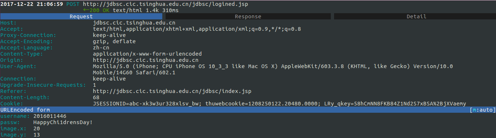

### 其他HTTP操作

<!-- [93001查号台](http://ch.93001.cn/) 能不能注入？-->

#### 根证书下载

http://portal.tsinghua.edu.cn/certs/certinstall.html

#### [后勤综合信息](http://hq.tsinghua.edu.cn/)

能够注入，起shell

### 使用HTTPS

共20个网站，其中一个证书无效

#### [新版网络学堂](http://learn.cic.tsinghua.edu.cn/index)

重定向至id，https明文POST密码，不能直接mitm

MD5：fa8077873a7a80b1cd6b185d5a796617

原串：WLXT

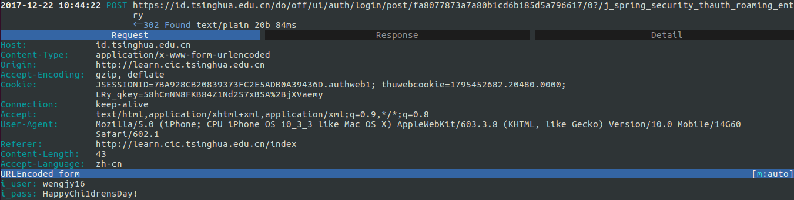

#### [学生职业发展指导中心](http://career.cic.tsinghua.edu.cn/xsglxt/dwlogin)

重定向至id，https明文POST密码

MD5：46f28b11f8bbe53ee983df1df6b5eb5a

原串：XSGLX

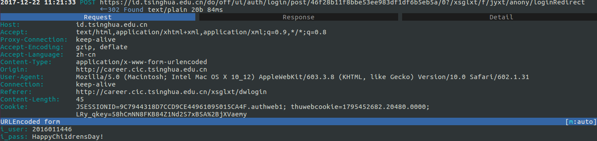

http://career.cic.tsinghua.edu.cn/xsglxt/f/jyxt/anony/dwRegister 能不能注入？

#### [学生社团](http://shetuan.student.tsinghua.edu.cn/)

重定向至id，https明文POST密码

MD5：c5d2f775bf1acacfb4f9b277ebe3604e

原串：XSHDGL

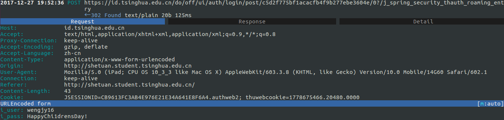

#### [试剂材料信息管理系统](http://mass.tsinghua.edu.cn/chem/www/index.php/Loginout/Index/login.html)

跳转到id登录，允许sslstrip

MD5：5e59a8ff5519b97719ea0f269c11d5ad 

原串：HXSJGL

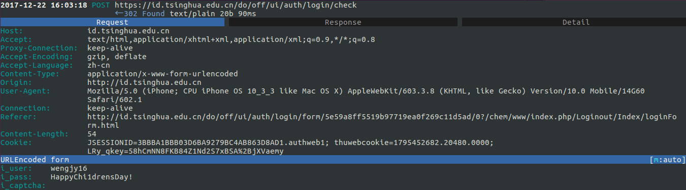

#### [学生清华](http://student.tsinghua.edu.cn/)

重定向至id，https明文POST密码

MD5：79aba9a0e7d4a372628098edefed1b67

原串：XSGZPT

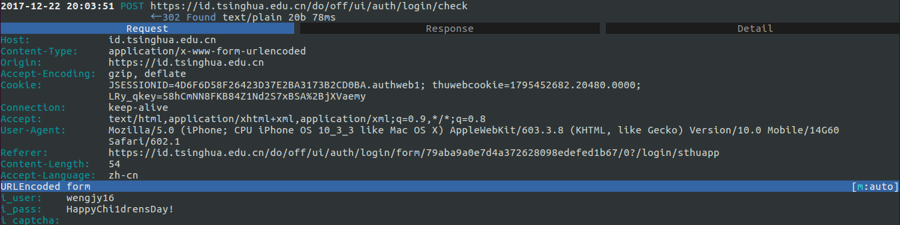

#### [研究生院办公系统](http://cwstask.internal.tsinghua.edu.cn/f/tdm/index/login)

重定向至id，https明文POST密码

MD5：dd42a998ec1ef2d7179a02dad68c2ec9

原串：YOARWFW

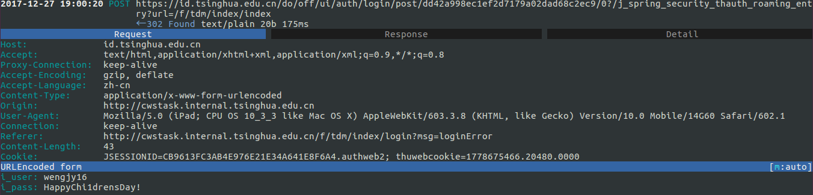

#### [基础数据库管理系统](http://jcsj.cic.tsinghua.edu.cn/f/tdm/index/login)

重定向至id，https明文POST密码

MD5：9c0187a476c37a5662c4a2feac514873

原串：JCSJ

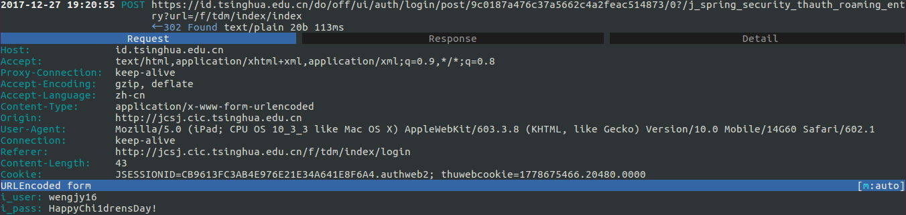

#### [无线校园网](http://net.tsinghua.edu.cn/wireless/)

使用https post，但是cookie为明文

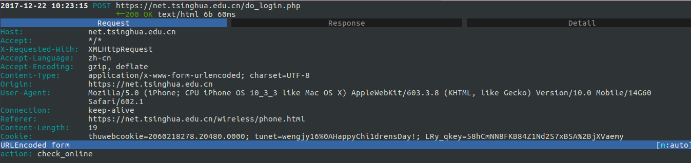

#### [网络学堂](http://learn.tsinghua.edu.cn/)

https明文POST密码

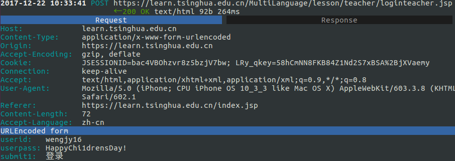

#### [选课系统](http://zhjwxk.cic.tsinghua.edu.cn/xklogin.do)

https明文POST密码，不能直接mitm

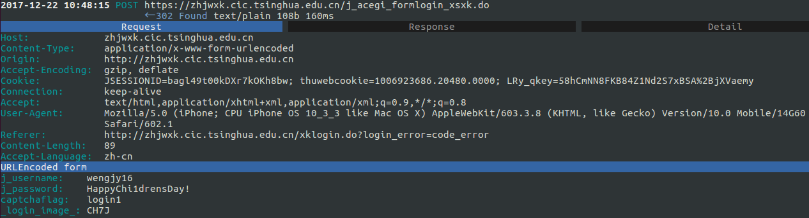

#### [教学门户](http://academic.tsinghua.edu.cn)

https明文POST密码

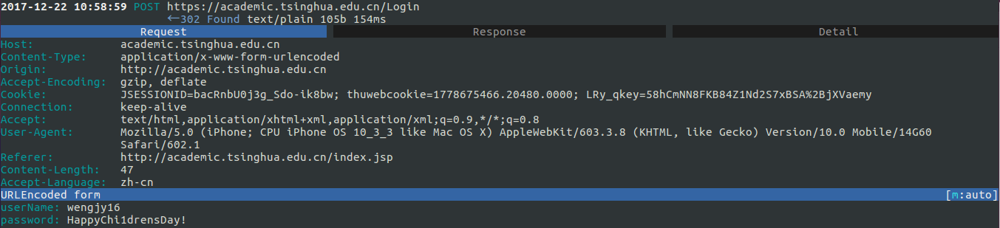

#### [进修生选课系统](http://zhjw.cic.tsinghua.edu.cn/jxsxk/login_zh.jsp)

https明文POST密码，不允许sslstrip

#### [港澳台招生](http://xgmsszs.join-tsinghua.edu.cn/bz.xgmss_login.jsp)

https明文POST密码，不允许sslstrip

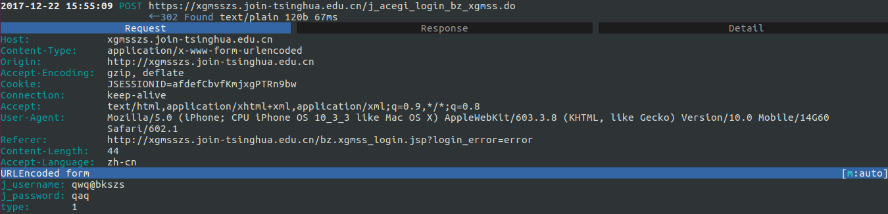

#### [校外访问](https://sslvpn.tsinghua.edu.cn/)

无法mitm和sslstrip

#### [网络信息用户修改密码](https://id.tsinghua.edu.cn/do/off/ui/pwd/change)

https://id.tsinghua.edu.cn/f/login

#### [图书馆登录](https://primo-pmtch01.hosted.exlibrisgroup.com/pds?func=load-login&calling_system=primo&institute=86THU&lang=chi&url=https://tsinghua-primo.hosted.exlibrisgroup.com:443/primo_library/libweb/pdsLogin?targetURL=https%3A%2F%2Ftsinghua-primo.hosted.exlibrisgroup.com%2Fprimo-explore%2Fsearch%3Fquery%3Dany%25252Ccontains%25252Casd%26tab%3Dprint%25255Ftab%26search_scope%3Dprint%25255Fscope%26vid%3D86THU%26lang%3Dzh%25255FCN%26from-new-ui%3D1%26authenticationProfile%3D86THU_PDS)
https明文POST密码

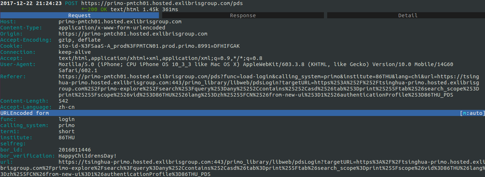

#### [网络账号自助服务](https://usereg.tsinghua.edu.cn/login.php)

https POST哈希过的密码

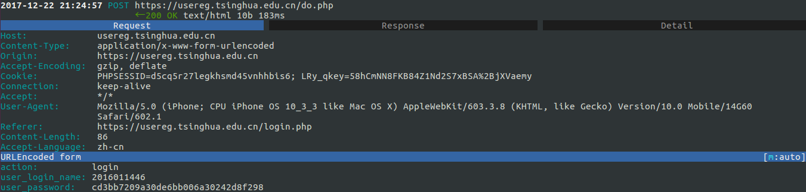

#### [教工合并帐号](https://auth.cic.tsinghua.edu.cn/f/login) 

证书无效

## APP

### iTUNet && iTUNow

应该没啥漏洞，Lab$\mu$做的

经过测试，他们应该是应用https加密传输数据，连中间人使用`sslstrip`的方法攻击都无法监听流量。

### AtTsinghua

#### WiFi相关

##### WiFi认证

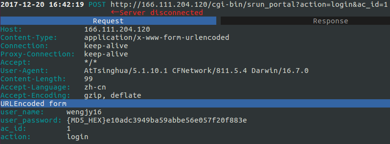

iOS/Android：用http post MD5加密过的密码

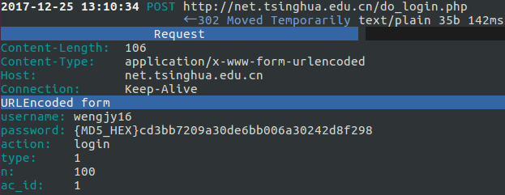

##### 为其他ip做认证、余额查询及流量监控

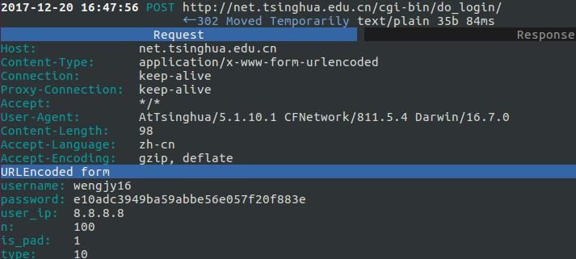

iOS/Android：都是http post MD5后的密码

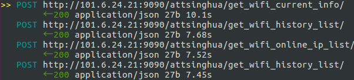

#### 一站访问

iOS：加密通信无法窃听

Android：可窃听，模拟网页访问

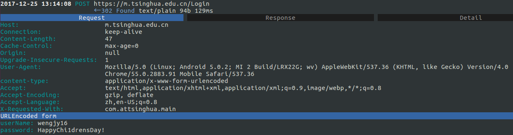

#### 移动INFO

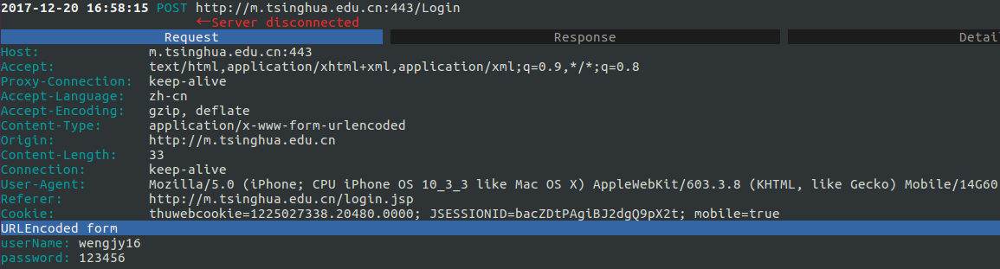

iOS/Android：https明文POST密码

#### 我的课表

iOS/Android：明文GET密码
