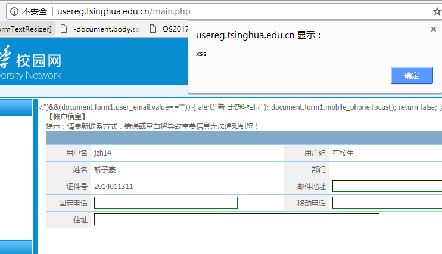

# usereg.tsinghua.edu.cn的漏洞利用

> 计42 靳子豪
>
> 计64 翁家翌

## 漏洞概览

1. usereg.tsinghua.edu.cn提供了强制下线的功能，但并未检查用户请求下线的IP地址是否用自己的校园网账号登录，因此可以在未经授权的情况下造成其他用户校园网下线。
2. usereg.tsinghua.edu.cn账户信息存在存储型XSS
3. usereg.tsinghua.edu.cn查看记录存在反射型XSS

## 攻击代码

攻击者使用自己的校园网账号登录usereg.tsinghua.edu.cn，发送如下POST请求：

```
POST /online_user_ipv4.php HTTP/1.1
Host: usereg.tsinghua.edu.cn
Cookie: PHPSESSID=xxxxxxxxxxxxxxxxxxxxxxxx

action=drops&user_ip=16472515,
```

每次一台设备上线校园网，系统都会给它分配一个user_ip值。

由于系统并未检查user_ip和当前登录`usereg.tsinghua.edu.cn`的账号的从属关系，因此我们修改上述请求中的user_ip，发出这个请求，即可下线其他用户登录的主机，造成网络连接中断。

经过测试发现，user_ip是简单递增且不会归零的，因此可以根据一台设备上线的时间猜测user_ip值。

在usereg首页的账户信息中可编辑的字段（例如住址）输入如下内容：
```
"><script>alert("xss");</script><
```
并点击"更新"，刷新页面即可看到弹窗，再次登录仍然会出现弹窗

在上网明细、缴费记录、结算记录、操作日志中可编辑的字段（例如日期）输入如下内容：
```
"><script>alert("xss");</script>
```
并点击"查询"，即可看到弹窗

## 实际测试



## 可能的修复方案

1.
    * 检查user_ip是否从属于当前登录`usereg.tsinghua.edu.cn`的账号
    * 或
    * 使用加盐(salt)的MD5/SHA1等散列算法处理user_ip值，防止猜解

2.
    * 对账户信息的用户输入内容进行过滤

3.
    * 对查看记录的用户输入内容进行过滤