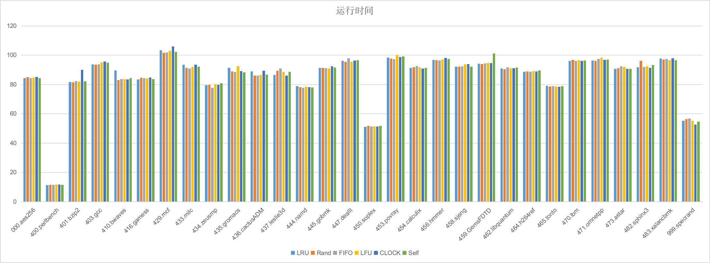
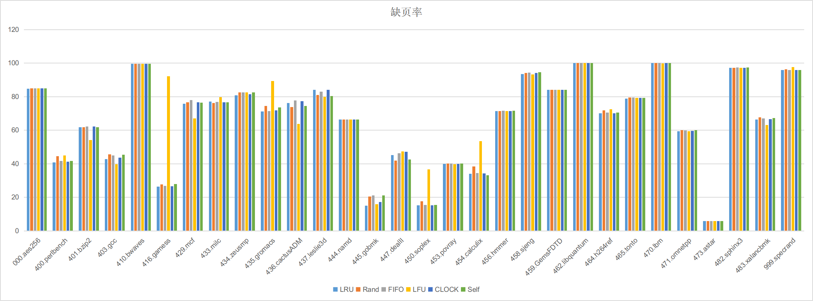

# Cache 实验

> 计64 翁家翌 2016011446

## 不同Cache替换算法核心思想

以下算法均实现在程序中，编号如下：

0. LRU
1. Rand
2. FIFO
3. LFU
4. CLOCK
5. Self 自己提出的替换策略

### Random

每次随机选择一个块进行替换，实现简单且不会带来额外开销。

### FIFO

每次选择最早读入的块进行替换。该算法只考虑了块换入时间，没考虑换入之后的访问情况。当我们频繁访问某一段数据的时候，FIFO算法表现就会变差。

### LRU

每次选择上次访问时间最早的块进行替换。可以做到更新O(1)，查询O(assoc)的复杂度，而不必维护一个栈，只要记录时间戳就行。此外，如果一个新换入的块之后没有再访问，在LRU中需要很长时间才会被替换出去。

### CLOCK

维护一个指针，每次查询的时候循环遍历所有的块，并更新它们的状态（1->0），直到找到一个状态为0的块。访问的时候把这个块的状态设置为1。

### LFU

对每次访问的块，计数器+1；在需要替换的时候，寻找所有块中计数器最小的那个替换出去，意味着这个块在连续一段时间内访问次数最少。

### 自己设计的Cache替换算法

经过实验测试，我自己提出的算法有着和Random一样的效率和CLOCK算法几乎一样的性能。

It's very simple but elegent.

假设每一个way的assoc=6，那么我们在缺页的时候按照 012345 543210 012345 ……的顺序进行替换。

如果都是012345 012345 那么就退化成FIFO，但是为了避免FIFO的缺陷，把偶数段的访问顺序倒过来，这样就能在频繁访问某一段数据的时候会比FIFO更有优势。

时间复杂度：O(1)

空间复杂度：O(way)，对于每个way维护一个指针

## 自己生成的trace

我写了一个AES-256-CBC算法，加密长度为262144的随机字符串。该加密算法在现实生活中十分常用，并且访存很有规律，因此具有一定的代表性。

## 测试过程

我仅在生成trace的时候使用了Ubuntu 10.04，实际运行的时候在物理机Ubuntu 18.04上运行，CPU配置为i7-8750H，6核12线程。Cache构造采用默认参数，即在第三级Cache上进行，大小为1024KB，行大小64B，16路组相连。

我编写了Python3脚本进行自动化测试，`run.py` 是运行实验脚本，会生成结果在 `result` 文件夹下；`stat.py` 是统计实验数据脚本，会集中统计 `result` 文件夹下的测试结果。我自己生成的trace编号为000。

## 实验结果

下图展示了6个算法的运行时间。可以看到几乎没什么差别，偶尔有剧烈波动。我推测是软件模拟所致，如果是硬件上直接测的话应该不会出现这种情况。

下图展示了各个算法的缺页率。可以看到LFU一枝独秀，在某些测试点上缺页率出奇的高，某些点上出奇的低，其他算法差别也并不是很大。

下表展示了将所有测试结果求平均之后的量化数据。

| Metric        | LRU           | Rand          | FIFO      | LFU       | CLOCK     | Self      |
| ------------- | ------------- | ------------- | --------- | --------- | --------- | --------- |
| Time (s)      | 85.412250     | **85.185100** | 85.253345 | 85.544764 | 85.726653 | 85.538834 |
| Miss Rate (%) | **65.301799** | 66.037946     | 65.959556 | 68.679096 | 65.667729 | 65.687256 |

我认为Time没有什么参考价值，毕竟软件模拟。我运行了两次，波动还比较大……

平均缺页率非常值得仔细品味：按照测试结果，可以得出LRU<CLOCK≈Self<FIFO<Rand<LFU，因此得出结论，我自己设计的算法具有非常高的性价比。

LRU也并不是所有的时候都能做出最优决策，比如在401.bzip2中Random算法也比LRU好稍微一点点。因此不能笼统的说某个算法优于某个算法，毕竟置换算法的性能极大依赖于访问模式。

此外我还发现有若干个测试点并不需要进行块换出，因为1024KB已经足够。

CPI此处不列，因为与缺页率正相关。

下表展示了在我自己设计的trace `000.aes256`上面的测试结果：

| Metric        | LRU           | Rand      | FIFO      | LFU       | CLOCK     | Self      |
| ------------- | ------------- | --------- | --------- | --------- | --------- | --------- |
| Time (s)      | **84.226488** | 84.838721 | 84.284486 | 84.723518 | 85.236479 | 84.376378 |
| Miss Rate (%) | **84.8167**   | 84.8553   | 84.8746   | 84.8682   | 84.8746   | 84.8746   |

运行时间而言，显然LRU实际情况不可能快过Random，又一次说明了软件模拟的时间不靠谱；LRU在缺页率上取得了最优表现，FIFO、CLOCK和Self都拥有着相同缺页率，因为对于AES-256-CBC的访存模式而言，这三个算法给出的替换策略是一致的。