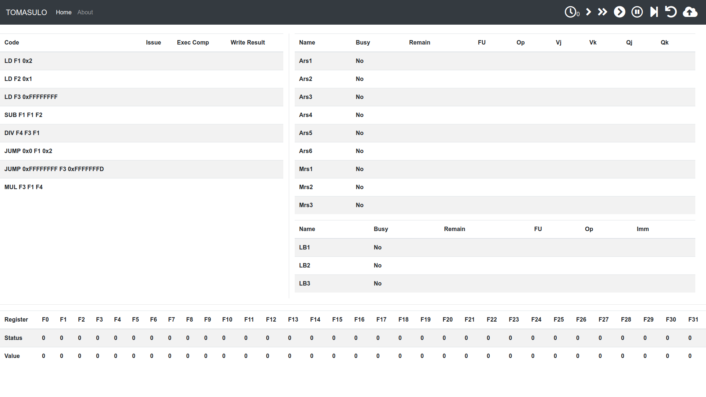

# Tomasulo

> 计64 翁家翌 2016011446

目前已部署在 `http://tmsl.tuixue.online` 中，如果服务器没欠费的话，可以直接访问。


## 环境配置

使用python3完成，在一个安装了正常的软件包（如python3-pip）的ubuntu机子上，运行如下命令：

```bash
sudo pip3 install "web.py==0.40.dev1" numpy
```

然后使用命令

```bash
python3 main.py [port]
```

即可在浏览器中打开 `http://localhost:[port]` 查看效果。其中port可缺省，默认为8080端口。

前端采用Bootstrap4实现


## 效果图



其中支持如下功能（按照右上方图标[1:]从左到右顺序）：

1. 单步执行
2. 多步执行，可输入步数
3. 自动执行，以一定时间间隔
4. 取消自动执行
5. 运行到程序结束
6. 重置
7. 更新nel代码

由于前后端分离，因此无法简洁地实现多用户访问，只能保证程序在单用户访问的情况下不会出事。


## 设计细节

核心代码位于 `tomasulo.py` 中，对外暴露了几个必要的函数接口：

1. `set_nel(string)`：设置nel程序
2. `run(int)`：模拟硬件运行
3. `get_state()`：获取模拟器内部状态，用于前端页面渲染

模拟器内部最主要的函数是 `step()`，每次只执行一个时钟周期，具体分为4个步骤，依次执行：

1. `clear_cdb()`：清除数据总线上的任务；具体而言，针对当前周期写回完成的指令，修改其目标寄存器和相关的保留站的状态，如果指令为JUMP则顺便更新一下当前的执行指令位置
2. `update()`：将保留站中正在执行的指令的剩余时钟周期-1；如果执行完成，则更新代码的Exec Comp状态，并设置下一轮的写回状态到cdb中
3. `lookup_fu()`：查看保留站中未执行的指令在当前周期能否被执行
4. `issue()`：查看当前指令能否被发射，如果为JUMP并且正在被执行则等待，否则按顺序执行

4个步骤按照流水线的倒序顺序来执行，否则就会出现后进来的指令先执行的情况。

此外，利用python中的引用机制（比如list怎么传都是浅拷贝），能够大幅度减少代码：比如cdb和rs的维护，可以直接传一个list进去，然后里面的值改了外面的值也会跟着改。同样代码使用Java或者Javascript可能要更复杂的实现。

有一个细节：我在一条指令进来的时候先给他分配了一个FU，即便这条指令的QjQk都非空。这么做代码会少一些，不过可能会有潜在的问题。但是我想了想，LB不存在阻塞问题；Ars6:3，并且执行周期短，不太会出现问题；Mrs3:2，执行周期相对长，或许……大概率不会出问题？

Update：一个反例

```bash
LD F1 0x2
LD F2 0x2
MUL F1 F1 F1
MUL F2 F2 F2
ADD F3 F1 F2
ADD F4 F1 F2
ADD F5 F1 F2
ADD F6 F6 F6
ADD F7 F7 F7
ADD F8 F8 F8
```

应该先执行最后三个ADD，然后等MUL结束之后再执行前三个ADD，因此上述做法是有问题的。

Update：已修改完成，其实也没改多少行代码。


## 性能测试

点击多步运行，输入100000（十万），来个死循环，大概1.8s这样能执行完。相比 `https://tomasulo.harrychen.xyz/`，同样程序他运行10000（一万）次就得花2-3s，我的效率是他的十倍左右。

（谁说python代码慢？）

附：死循环代码如下：

```bash
LD F1 0x0
MUL F3 F1 F1
JUMP 0x0 F3 0xFFFFFFFE
```


## 其他测试

一些其他的测例位于example下，可以进行测试