# 网络配置实验

> 计64 翁家翌 2016011446


## 任务1

错误：Router3不应该配20开头的公网ip地址，改成`10.2.3.3`

第一处：Router2的端口2与Router3相连，应与Router3的端口1的ip地址处于同一子网，配成`10.2.3.1`

第二处：Server0的网关，由于Server0处在Router1的端口1所在的子网内，因此其网关应设置为Router1端口1的 ip，即`192.168.1.1`。

以下是ip分配方案完整表格，修改的部分用粗体表示：

| Device  | Port         | IP           | Mask | Gateway     |
| ------- | ------------ | ------------ | ---- | ----------- |
| Router1 | 端口1        | 192.168.1.1  | /24  | -           |
| | 端口2   | 10.1.2.1     | /24          | -    |
| Router2 | 端口1        | 10.1.2.2     | /24  | -           |
| | 端口2   | **10.2.3.1** | /24          | -    |
| | 端口3   | 192.168.2.1  | /24          | -    |
| Router3 | 端口1        | **10**.2.3.3 | /24  | -           |
| | 端口2   | 192.168.3.1  | /24          | -    |
| PC0     | 端口1        | 192.168.1.2  | /24  | 192.168.1.1 |
| PC1     | 端口1        | 192.168.2.2  | /24  | 192.168.2.1 |
| Server0 | 端口1        | 192.168.1.3  | /24  | **192.168.1.1** |
| Laptop0 | 端口1        | 192.168.1.4  | /24  | 192.168.1.1 |
| Laptop1 | 端口1        | 192.168.2.3  | /24  | 192.168.2.1 |
| Laptop2 | 端口1        | 192.168.3.2  | /24  | 192.168.3.1 |
| Laptop3 | 端口1        | 192.168.3.3  | /24  | 192.168.3.1 |

由于Router从1开始编号非常不好，下面就都是Router[0,1,2]（其实是做到任务3反应过来之后图都截完了不想在截一遍……）

## 任务2

PacketTracer版本为7.2，运行在Ubuntu18.04中。6.3的windows版本直接用wine在ubuntu下运行有一些问题。

首先选用交换机型号为`2960-24TT`，路由器型号为`2811`。给Router1增加一块`NM-1FE-TX`扩展模
块之后，初步连线如下：

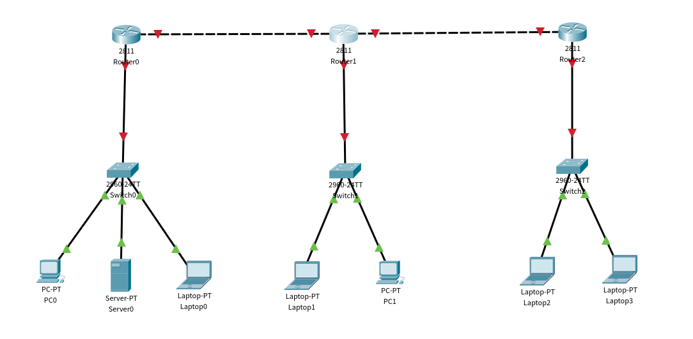

可以看到下面的网络设备连接成功，但是路由器之间并不能相互通信。接下来要按照任务1中的ip分配方案配置各台机器的ip，对于终端设备而言（此处以PC0为例）：

1. 点击`PC0 -> Desktop -> IP Configuration`
2. 选择静态路由 `static` 选项，依次填充 `IP Address`、`Subnet Mask`、`Default Gateway`选项，如下图所示：

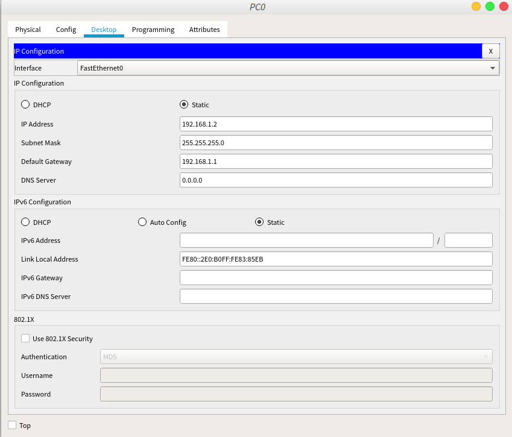

对于路由器而言（此处以Router1为例）：

1. 点击 `Router1 -> Config -> FastEthernet0/0`
2. 勾选 `On`
3. 在 `IP Configuration` 填充 `IP Address`、`Subnet Mask`字段
4. 点击下一个 `FastEthernet`，重复过程1~3，直至所有端口配置完成

路由器的一个端口配置完成之后的界面如下所示：

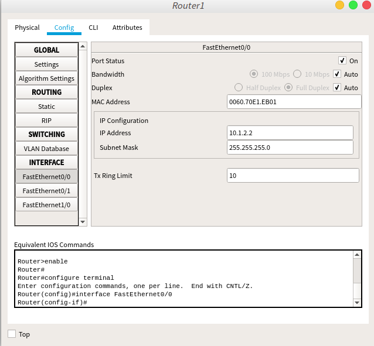

都配置完成之后，可以看到线全变绿了，说明配置成功。截屏如下：

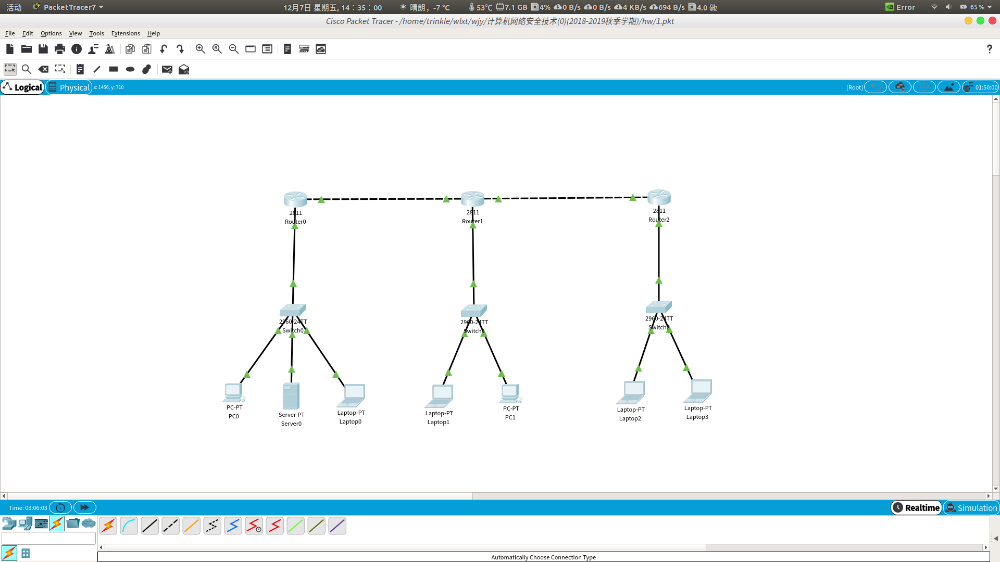

## 任务3

（其实在哪个Router设置密码都一样）

打开Router1的CLI，enable之后进入特权模式，输入如下命令：

```bash
configure terminal
line console 0
password wjyconspw # set console password
login
end

configure terminal
enable password wjyprivpw # set privilege password
line vty 0 4
password wjytelnpw # set telnet password
login
end
```

截图如下：（特地以自己名字首字母wjy打头进行身份验证）

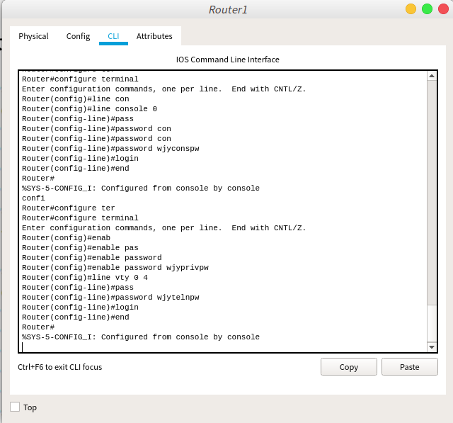

查看password2配置：`show running-config`

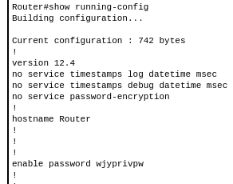

查看password1和3的配置：

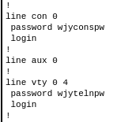

可见密码均以明文形式存储

当路由器配置文件可能被泄露时，使用密文存储密码，即使用命令 `service password-encryption`

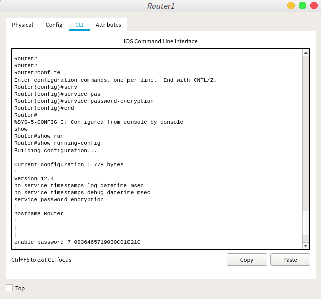

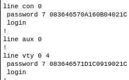

可以看到所有密码都以加密形式存储在路由器配置文件中，因此当路由器配置文件遭到泄露时依然有安全保障。

以下是测试密码是否真的生效了：

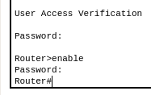

## 任务4

设置路由器的静态路由表：以Router0的配置为例，将所有无法由Router0直达的网段全部配置路由，如下所示：

```bash
configure terminal
ip route 192.168.2.0 255.255.255.0 10.1.2.2
ip route 192.168.3.0 255.255.255.0 10.1.2.2
ip route 10.2.3.0 255.255.255.0 10.1.2.2
```

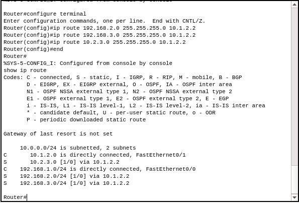

Router1：

```bash
configure terminal
ip route 192.168.1.0 255.255.255.0 10.1.2.1
ip route 192.168.3.0 255.255.255.0 10.2.3.3
```

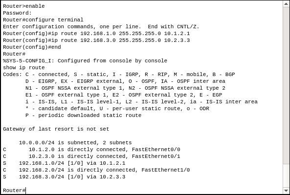

Router2：

```bash
configure terminal
ip route 192.168.1.0 255.255.255.0 10.2.3.1
ip route 192.168.2.0 255.255.255.0 10.2.3.1
ip route 10.1.2.0 255.255.255.0 10.2.3.1
```

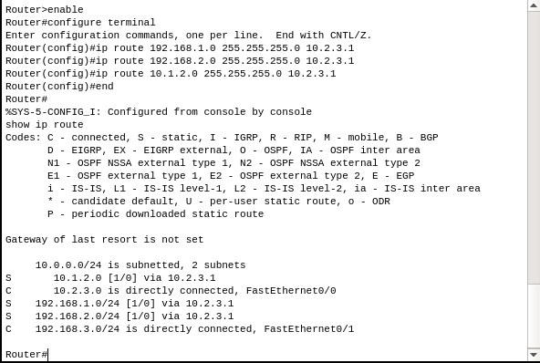

icmp ping测试：

1. Router2 ping Router0

   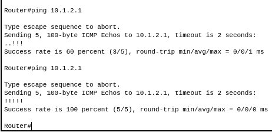

2. PC0 ping Laptop2

   

## 任务5

存在问题，RIP协议上限为16跳，也就是如果一个网络的直径不超过15即可适用RIP协议。考虑极端情况，16台设备连成一条链，直径为16，一端无法传递信息到另一端。

一般而言，维护公司局域网使用RIP协议即可。对每个路由器使用RIPv2协议配置动态路由，以Router2为例：

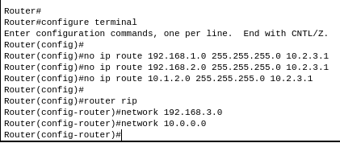

配置生效之后点击加速，然后测试Laptop2 ping PC0：

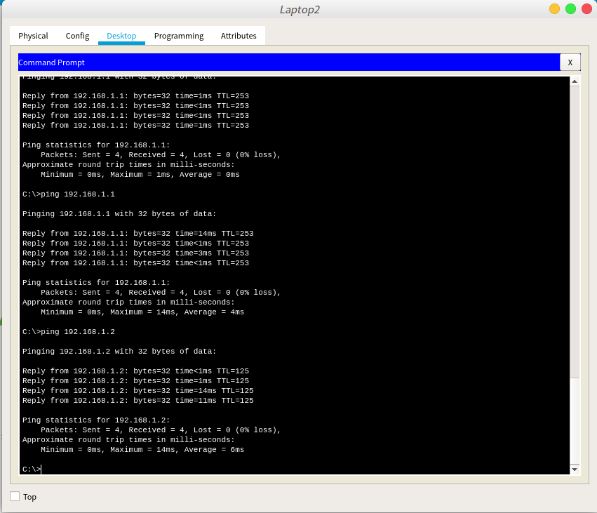

## Bonus

设置密码为123之后：

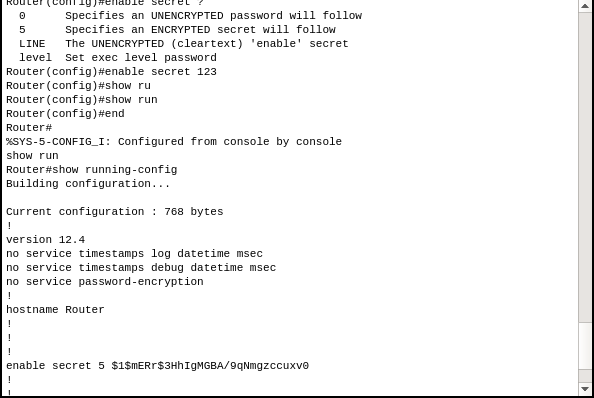

更多尝试：

```bash
123          -> secret 5 $1$mERr$3HhIgMGBA/9qNmgzccuxv0
124          -> secret 5 $1$mERr$05KPbY0jaeCDqx5NXF.9J/
125          -> secret 5 $1$mERr$otG8qqYg/7DRk46LIxkf7.
125555555555 -> secret 5 $1$mERr$IkHkNYNMw8gKLFtbI6NPs/

# 另一个Router
123          -> secret 5 $1$mERr$3HhIgMGBA/9qNmgzccuxv0
```

`$1$mERr$`应该是固定前缀，和Router无关。搜`cisco secret5`发现是MD5，1指MD5，mERr是salt，在linux下使用`openssl`验证：

```bash
➜  ~ openssl passwd -1 -salt mERr -table 123
123	$1$mERr$3HhIgMGBA/9qNmgzccuxv0
```

